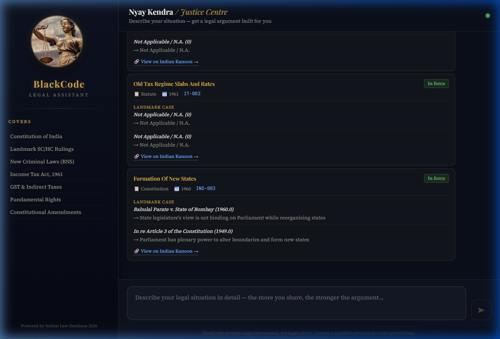
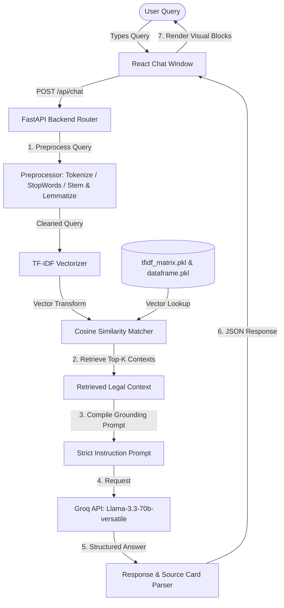
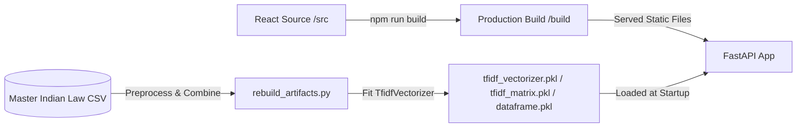

# ⚖️ BlackCode: Indian Legal Chatbot Assistant

BlackCode is a state-of-the-art, Retrieval-Augmented Generation (RAG) legal assistant designed to help common Indian citizens understand their legal rights and positions in simple language. Leveraging the power of **Groq's Llama-3.3-70b-versatile** and a customized **TF-IDF semantic database matcher**, the chatbot translates complex statutory language and landmark case laws into structured, actionable, and easy-to-understand legal advice.

---

## 📸 Interface Preview



---

## 🚀 Key Features

* **Natural Language Querying**: Describe any legal dispute, grievance, or question in conversational English.
* **Grounded Law Retrieval**: Matches user inputs semantically against a database of the Constitution of India, Landmark SC/HC Judgments, New Criminal Laws (BNS/BNSS/BSA), Income Tax Act 1861, and GST codes.
* **Structured Legal Arguments**: Responses are parsed dynamically into dedicated, color-coded blocks:
  * ⚖️ **Legal Position**: A clear, one-sentence summary of the user's rights or claims.
  * 📜 **Applicable Laws**: Explanations of relevant articles/sections in simple words.
  * 🗣️ **The Argument**: Logically mapped connections between the facts and the retrieved laws.
  * 📋 **Supporting Judgments**: Landmark cases with holding summaries supporting the position.
  * ✅ **Practical Guidance**: Actionable next steps (e.g., proper courts, writ filings, documents to gather).
* **Direct Citation Verification**: Provides matching source cards linking out to **Indian Kanoon** for primary source verification.

---

## 🏗️ System Architecture

The following diagram illustrates the request lifecycle when a user asks a question to BlackCode:



### Data Preparation & Build Pipeline (Offline)



---

## 💻 Tech Stack

| Layer | Technologies / Libraries |
| :--- | :--- |
| **Frontend** | React (v19), Axios, HTML5 Semantic Tags, Custom Responsive CSS (Glassmorphism & Micro-animations) |
| **Backend** | FastAPI, Uvicorn (ASGI), Pydantic (v2) |
| **Data & RAG** | Scikit-Learn (TF-IDF Vectorizer), NumPy, Pandas, NLTK (Tokenization, Stemming, Lemmatization) |
| **LLM Inference** | Groq Python SDK (Llama-3.3-70b-versatile) |

---

## 🛠️ Setup & Installation

### Prerequisites
* Python 3.12+ (Recommended)
* Node.js (v18+)
* Groq API Key (Get it from the [Groq Console](https://console.groq.com/))

### 1. Backend Configuration
1. Navigate to the backend directory:
   ```bash
   cd blackcode-backend
   ```
2. Create a virtual environment and activate it:
   ```bash
   uv venv .venv --python 3.12
   # On Windows:
   .venv\Scripts\activate
   # On macOS/Linux:
   source .venv/bin/activate
   ```
3. Install dependencies:
   ```bash
   uv pip install -r requirements.txt fastapi uvicorn groq
   ```
4. Create a `.env` file in the `blackcode-backend` directory and add your Groq API key:
   ```env
   GROQ_API_KEY=your-actual-groq-api-key-here
   ```

### 2. Frontend Build
Compile the frontend static assets so they can be served directly by the FastAPI backend:
1. Navigate to the frontend directory:
   ```bash
   cd ../blackcode-frontend
   ```
2. Install npm packages:
   ```bash
   npm install
   ```
3. Compile the build folder:
   ```bash
   npm run build
   ```

### 3. Launching the Application
Launch the unified server from the `blackcode-backend` directory:
```bash
cd ../blackcode-backend
.venv\Scripts\python.exe -m uvicorn main:app --host 127.0.0.1 --port 8000
```
Open **[http://localhost:8000/](http://localhost:8000/)** in your browser to interact with the application. The Swagger API documentation is available at `/docs`.

---

## 📝 Disclaimer
*BlackCode provides legal information grounded in verified laws and judgments. It does not constitute formal legal advice. For filing proceedings in court, always consult a qualified advocate.*
